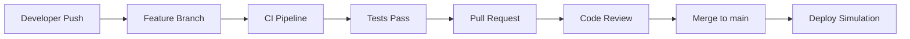

# GitHub Actions CI/CD Pipeline

Este documento descreve a configuração completa das GitHub Actions para o projeto React Login System.

## 📋 Visão Geral

O projeto utiliza 3 pipelines principais para automação de CI/CD:

1. **Frontend CI Pipeline** - Testes e build do frontend React
2. **Backend CI Pipeline** - Testes e segurança do backend Flask
3. **Deploy Simulation** - Simulação de deployment Docker

## 🚀 Estrutura dos Workflows

### Frontend Pipeline (`.github/workflows/frontend.yml`)

**Trigger:**
- Push para branches `main` ou `github-actions` com mudanças em `frontend/`
- Pull requests para `main` com mudanças em `frontend/`

**Etapas:**
1. **Setup Node.js 18** - Configuração do ambiente Node.js
2. **Install Dependencies** - Instalação com `npm ci` para cache otimizado
3. **Security Audit** - Verificação de vulnerabilidades com `npm audit`
4. **Unit Tests** - Testes unitários com coverage
5. **Integration Tests** - Testes de integração
6. **Build Application** - Build de produção do React
7. **Docker Validation** - Build e teste da imagem Docker
8. **Playwright Tests** - Testes end-to-end (job separado)

**Logs Relevantes:**
- Instalação de dependências com timestamps
- Resultados dos testes com coverage
- Logs do Docker container
- Relatórios do Playwright

### Backend Pipeline (`.github/workflows/backend.yml`)

**Trigger:**
- Push para branches `main` ou `github-actions` com mudanças em `backend/`
- Pull requests para `main` com mudanças em `backend/`

**Etapas:**
1. **Setup Python 3.13** - Configuração do ambiente Python
2. **Install Dependencies** - Instalação via `requirements.txt`
3. **Security Audit** - Scan com `safety`
4. **Database Tests** - Testes do banco de dados
5. **Security Tests** - Testes de segurança
6. **Application Tests** - Testes gerais da aplicação
7. **Docker Validation** - Build e teste da imagem Docker
8. **Security Scan** - Scan de vulnerabilidades com Trivy
9. **Code Quality** - Linting e formatação com flake8/black/isort

**Logs Relevantes:**
- Instalação de dependências Python
- Resultados dos testes de segurança
- Relatórios do Trivy (SARIF)
- Logs de qualidade de código

### Deploy Simulation (`.github/workflows/deploy.yml`)

**Trigger:**
- Push para branch `main`
- Pull requests merged para `main`

**Etapas:**
1. **Docker Compose Build** - Build de todos os serviços
2. **Deployment Startup** - Inicialização dos serviços
3. **Health Checks** - Verificação de saúde dos serviços
4. **Integration Tests** - Testes de integração da aplicação
5. **Deployment Report** - Geração de relatório detalhado
6. **Production Simulation** - Simulação de deployment prod

**Logs Relevantes:**
- Status dos serviços Docker
- Logs de health check
- Resultados dos testes de integração
- Relatório de deployment

## 🔧 Configuração Local

### Pré-requisitos

```bash
# Git
git --version

# Docker
docker --version
docker-compose --version

# Node.js (para frontend)
node --version
npm --version

# Python (para backend)
python --version
pip --version
```

### Testar Workflows Localmente

```bash
# Instalar act (GitHub Actions runner)
# Windows: choco install act
# Mac: brew install act
# Linux: https://github.com/nektos/act

# Testar workflow específico
act -j frontend-ci
act -j backend-ci
act -j deploy-simulation

# Testar todos os workflows
act
```

## 📊 Artefatos e Relatórios

### Artefatos Gerados

**Frontend:**
- `frontend-build` - Build da aplicação React
- `playwright-report` - Relatórios dos testes E2E

**Backend:**
- `backend-test-results` - Resultados dos testes e security scan
- `security-scan-results` - Relatórios do Trivy

**Deployment:**
- `deployment-report-{run_number}` - Relatório completo do deployment
- `production-config-{run_number}` - Configuração de produção

### Visualização dos Artefatos

1. Acesse o repositório no GitHub
2. Vá para "Actions"
3. Selecione o workflow execution
4. Clique em "Artifacts" para baixar os relatórios

## 🛡️ Segurança Implementada

### Scans Automáticos

1. **Frontend:**
   - `npm audit` - Vulnerabilidades de pacotes npm
   - Playwright security tests

2. **Backend:**
   - `safety` - Vulnerabilidades de pacotes Python
   - Trivy - Scan de vulnerabilidades de container
   - Testes de segurança customizados

3. **Infrastructure:**
   - Docker security scanning
   - Code quality checks

### Políticas de Segurança

- Sem credenciais hard-coded nos workflows
- Uso de secrets do GitHub para dados sensíveis
- Imagens Docker com usuário não-root
- Health checks automáticos

## 🚀 Fluxo de Deployment

### Development Workflow



### Pipeline Triggers

1. **Development:**
   - Push para `github-actions` → CI pipelines
   - Pull requests → CI + validation

2. **Production:**
   - Push para `main` → Deploy simulation
   - Merge PR → Production simulation

## 🔍 Troubleshooting

### Problemas Comuns

**1. Falha no Cache do npm**
```bash
# Limpar cache local
npm cache clean --force
rm -rf node_modules package-lock.json
npm install
```

**2. Falha no Docker Build**
```bash
# Limpar Docker cache
docker system prune -a
docker-compose build --no-cache
```

**3. Falha nos Testes**
- Verificar logs completos no workflow execution
- Baixar artefatos para análise detalhada
- Rodar testes localmente com `act`

### Debug Local

```bash
# Verificar configuração do act
act --list

# Rodar workflow específico com verbose
act -j frontend-ci --verbose

# Verificar logs do Docker
docker-compose logs backend
docker-compose logs frontend
```

## 📈 Monitoramento

### Métricas Disponíveis

1. **CI/CD Pipeline Duration**
2. **Test Success Rate**
3. **Security Scan Results**
4. **Docker Image Size**
5. **Deployment Health Status**

### Alertas

Os workflows incluem verificações automáticas:
- Falha em testes → Notificação
- Vulnerabilidades críticas → Block
- Health check falhando → Rollback simulation

## 🔄 Manutenção

### Atualização de Dependências

```bash
# Frontend
npm update
npm audit fix

# Backend
pip install --upgrade -r requirements.txt
safety check
```

### Atualização de Workflows

- Revisar versões das Actions regularmente
- Atualizar versões de Node.js/Python quando necessário
- Manter documentação em dia

## 📝 Melhorias Futuras

1. **Integração com Cloud:**
   - AWS ECS/EKS deployment
   - Azure Container Instances
   - Google Cloud Run

2. **Monitoramento Avançado:**
   - Prometheus/Grafana integration
   - ELK stack para logs
   - Alertas customizados

3. **Segurança Adicional:**
   - SAST/DAST tools
   - Container signing
   - Policy as Code

## 📞 Suporte

Para dúvidas ou problemas:
1. Verificar logs completos no GitHub Actions
2. Consultar artefatos gerados
3. Testar localmente com `act`
4. Revisar documentação dos workflows

---

**Última atualização:** $(date)
**Versão dos workflows:** v1.0
