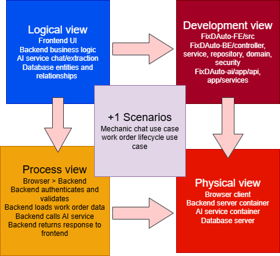
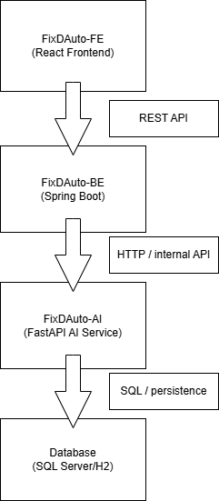
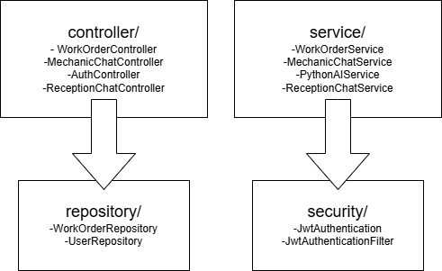
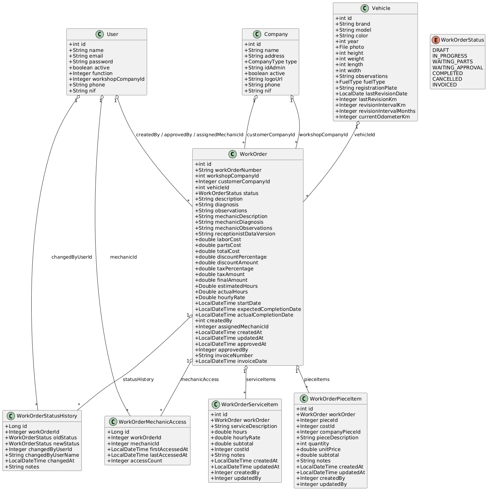

# FixDAuto Project Summary

This summary explains the complete FixDAuto architecture, draws the system using the 4+1 model, and provides C4 Level 2 and Level 3 diagrams in text form.

## 1. High-level architecture

FixDAuto is built as three cooperating applications:

- `FixDAuto-FE`: React + TypeScript frontend.
- `FixDAuto-BE`: Spring Boot backend.
- `fixdauto-ai`: Python FastAPI AI service.

Together they support workshop operations: vehicle check-in, work order management, service and parts itemization, mechanic collaboration, and AI-assisted diagnosis/extraction.

Important point:

- The frontend talks only to the backend.
- The backend talks to the AI service.
- The frontend does not call the AI service directly.
- The backend is the orchestrator that validates business rules, enforces security, and maps UI actions to database transactions.

## 2. 4+1 architectural views

The 4+1 model defines five views:

- Logical View: main functionality and core domain objects.
- Development View: code/module organization, packages, and services.
- Process View: runtime behavior, APIs, and communication.
- Physical View: deployment and infrastructure.
- +1 Scenarios: use cases and user flows.

### 2.1 Logical View

Focus: what the system does and how its domain is structured.

- Frontend presents the UI, captures user actions, and sends authenticated REST requests to backend controllers.
- Backend implements business logic for work orders, mechanic chat, reception chat, authentication, companies, vehicles, quotes, and orders.
- The backend also manages user roles, permissions, validation, and persistence of state.
- AI service provides natural language chat, diagnostics, work order extraction, and contextual reasoning based on work order history.
- Database stores users, companies, vehicles, work orders, service and piece items, status history, and mechanic access logs.
- Additional backend functions include data enrichment, audit tracking, error handling, and support for offline/online deployments via config.

### 2.2 Development View

Focus: physical code organization and modules.

- `FixDAuto-FE/`
  - `src/services/`: API clients, auth wrappers, and domain-specific request helpers.
  - `src/hooks/`: UI state, chat state, form state, and data loading logic.
  - `src/components/`: pages, forms, workflows, and reusable UI widgets.
  - `src/routes/` or routing code: navigation and protected route handling.
- `FixDAuto-BE/`
  - `controller/`: REST endpoints for work orders, chat, authentication, users, and administrative operations.
  - `service/`: business workflows, AI integration, validation, and orchestration between repositories.
  - `repository/`: JPA repositories and query access for users, companies, vehicles, work orders, and related child entities.
  - `domain/`: JPA entities, relationship mappings, and domain models.
  - `security/`: JWT filters, authentication manager, role-based authorization, and security configuration.
  - `configuration/` and `dto/`: application configuration, environment-driven behavior, and data transfer objects.
- `fixdauto-ai/`
  - `app/api/`: FastAPI routers exposing `/chat`, `/chat/detailed`, and `/chat/extract-work-order` endpoints.
  - `app/services/`: model selection, fallback orchestration, prompt engineering, and response normalization.
  - `data/` and `models/`: model artifacts, local cache, and prompt templates.

### 2.3 Process View

Focus: runtime behavior and communication.

- Browser sends requests to the backend.
- Backend controllers validate auth and user permissions.
- Backend services load data and apply business rules.
- For AI chat, backend calls the AI service.
- AI returns a response, backend persists results, and frontend displays them.

### 2.4 Physical View

Focus: deployment units and infrastructure.

- Browser client runs `FixDAuto-FE`.
- Backend server runs `FixDAuto-BE`.
- AI server runs `fixdauto-ai`.
- Database server runs SQL Server or H2.

### 2.5 4+1 Model Image

## 3. C4 Model: Level 2 and Level 3 diagrams

The C4 model is used for container and component diagrams.

### 3.1 Level 2: Container Diagram

### 3.2 Level 3: Component Diagram for `FixDAuto-BE`

Focus: internal backend components and their relationships.

### 3.3 Level 3: Backend components and data flow

- `WorkOrderController` handles work order CRUD and retrieval.
- `MechanicChatController` handles mechanic chat requests.
- `WorkOrderService` contains work order business rules, validation, and DTO conversion.
- `MechanicChatService` builds AI context from work orders and chat history.
- `PythonAIService` sends AI-related requests to `fixdauto-ai`.
- `WorkOrderRepository` and other repositories access the database.
- `JwtAuthenticationFilter` and `SecurityConfig` enforce auth.

### 3.4 PlantUML Domain Model

The domain model expressed in PlantUML shows the core entities and relationships across the system:

This model represents the main JPA entities: `WorkOrder`, `WorkOrderServiceItem`, `WorkOrderPieceItem`, `WorkOrderStatusHistory`, `WorkOrderMechanicAccess`, `User`, `Company`, and `Vehicle`, along with their associations and cardinalities.

**Reference:** This C4 modeling approach follows best practices from [Practical C4 Modeling Tips](https://revision.app/blog/practical-c4-modeling-tips).

## 4. Database and table relationships

### Core tables

The key tables are:

- `user`
- `company`
- `vehicle`
- `work_orders`
- `work_order_service_items`
- `work_order_piece_items`
- `work_order_status_history`
- `work_order_mechanic_access`

### Connection rules

- `work_orders` is the central parent table and the main domain entity for repair workflow.
- `work_order_service_items` and `work_order_piece_items` store the service lines and parts used by a work order.
- `work_order_status_history` records the lifecycle and status changes of the work order.
- `work_order_mechanic_access` tracks who accessed or modified the work order and when.
- `work_orders` references `company` through `workshop_company_id` and `customer_company_id` to distinguish the service provider from the customer.
- `work_orders` references `vehicle` through `vehicle_id` to connect repairs to the correct car, truck, or fleet asset.
- `user` stores authentication and role data, including mechanic, receptionist, and admin functions.
- Core domain relationships are designed so that the backend can safely reconstruct work order context for AI prompts and audit trails.

The right model is:

- `work_orders` anchors the repair workflow.
- Items and logs depend on `work_orders`.
- Companies and vehicles are referenced from `work_orders`.
- User roles and permissions determine which operations and data are visible at the frontend.
- Frontend never talks to AI directly; only backend talks to AI.

## 5. System flow summary

- The browser loads the React UI and the user authenticates through the backend.
- The frontend stores JWT tokens and sends authenticated API requests to `FixDAuto-BE`.
- Backend controllers route requests to services, enforce authorization, and validate payloads.
- Services coordinate repositories, apply business rules, and build domain objects.
- For AI chat, backend services assemble work order context and submit prompts to `fixdauto-ai`.
- The AI service selects the best available model, falls back as needed, and returns enriched text or extracted work order metadata.
- Backend persists AI responses, updates work order records when necessary, and returns structured results to the frontend.
- The frontend renders work orders, chat history, status updates, and user interactions in the UI.

This is the real execution path: frontend → backend → AI service, with the database supporting backend state and audit history.

## 6. Recommended entry points

- Frontend:
  - `FixDAuto-FE/src/services/api.ts`
  - `FixDAuto-FE/src/services/aiService.ts`
  - `FixDAuto-FE/src/hooks/useAIChat.ts`
- Backend:
  - `FixDAuto-BE/src/main/java/com/fix/dauto/controller/WorkOrderController.java`
  - `FixDAuto-BE/src/main/java/com/fix/dauto/controller/MechanicChatController.java`
  - `FixDAuto-BE/src/main/java/com/fix/dauto/service/WorkOrderService.java`
  - `FixDAuto-BE/src/main/java/com/fix/dauto/service/MechanicChatService.java`
  - `FixDAuto-BE/src/main/java/com/fix/dauto/domain/WorkOrder.java`
  - `FixDAuto-BE/src/main/java/com/fix/dauto/domain/User.java`
- AI Service:
  - `fixdauto-ai/app/api/routes/chat.py`
  - `fixdauto-ai/app/services/llm_service.py`